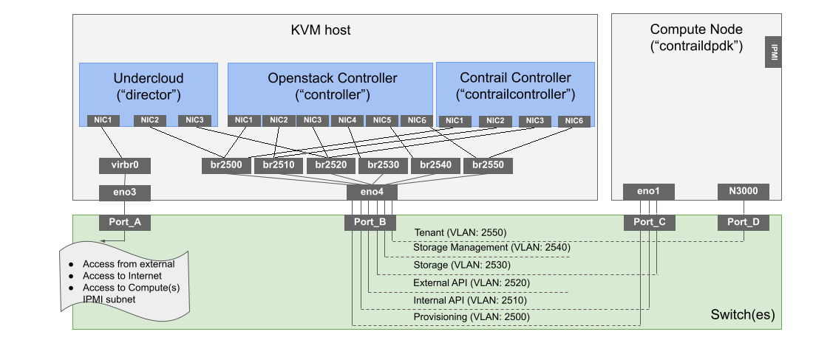

# 1. Introduction
This document describes steps required to configure and deploy Openstack and TungstenFabric with enabled support for Intel PAC N3000 smartnic card in full hardware flow offload mode.

Procedure is based on TF TripleO deployment process (documented on [Github TF Repository](https://github.com/tungstenfabric/tf-tripleo-heat-templates/blob/R2008/train/README.md)) with some modifications (e.g. related to infrastructure configuration/scaling) and additionally inludes steps necessary to set-up compute node(s) with TF vRouter DPDK in full hardware flow offload mode for Intel PAC N3000 card.

Following combinations of Operating System/OpenStack/Deployer/Contrail are supported (tested) for Openstack and TungstenFabric nodes:

| Operating System | OpenStack    | Deployer                 | TF version         |
| ---------------- | ------------ | ------------------------ | ------------------ |
| RHEL 8.2         | RHOSP 16.1   | TripleO (RHOSP Director) | TF R2011           |


## 1.1. Limitations
1. Single Intel PAC N3000 card (i.e. set-ups with two cards in server is not supported)
2. Intel PAC N3000 with 25Gb interfaces (N3000 cards with 10Gb interfaces are not supported by deployment templates)

## 1.2. Prerequisites
1. Intel PAC N3000 card "loaded" with FPGA user image
2. Locally available software:
   - Intel OPAE Software - Acceleration Stack for Runtime

> Note:
> Available versions are described [here](https://www.intel.com/content/www/us/en/programmable/products/boards_and_kits/dev-kits/altera/intel-fpga-pac-n3000/getting-started.html#n3000-n)
> `Intel Acceleration Stack Version 1.3.1` was used to prepare this procedure and is referenced hereafter (user guide for that version available [here](https://www.intel.com/content/www/us/en/programmable/documentation/zsf1588015530773.html#gvx1588110891876))

## 1.3 Configuration elements
1. Infrastructure
2. Undercloud
3. Overcloud

# 2 Infrastructure considerations

There are many different ways on how to create the infrastructure providing the control plane elements. In example approach described hereafter all control plane functions are provided as Virtual Machines hosted on KVM host (single instance of each control plane element (*High Availability to do)). Additionally on the same KVM host Undercloud (RHOSP Director) virtual machine is run.

KVM host:
- OpenStack Controller
- Contrail Controller
- Undercloud

In case of different infrastructure requirements / assumptions, one need to modify relevant configuration according to his setup.

> Note:
> This documentation assumes RHEL 8.2 or Centos 8.2 as operating system on KVM host

## 2.1 Example topology
Deployment configuration assumes following logical topology:


In this example network isolation for control elements (VMs) is provided by means of separate network interfaces (vNIC as control is provided in virtual machines). Compute node(s) uses VLANs for Openstack networks while tenant network is setup on Intel PAC N3000 card (separate interface).
Following VLANs and subnets are used:

| Network Name (shor name)          | VLAN  | Subnet       |
| --------------------------------- | ----- | ------------ |
| Provisioning (prov)               | 2500  |10.7.5.0/26   |
| Internal API (int_api)            | 2510  |10.7.5.64/27  |
| External API (ext_api)            | 2520  |10.7.5.96/27  |
| Storage (storage)                 | 2530  |10.7.5.128/27 |
| Storage Management (storage_mgmt) | 2540  |10.7.5.160/27 |
| Tenant (tenant)                   | 2550  |10.7.5.192/27 |


# 3. Infrastructure configuration

## 3.1 Physical switch(es)
Logical ports' configuration:
- Port_A: configuration relevant for one environment setup; this port should provide access from external to KVM host (and through this port IPMI subnet of compute should be reachable)
- Port_B: trunk port, configured required networks/VLANs: 2500, 2510, 2520, 2530, 2540, 2550
- Port_C: trunk port: provisioning network configured as native VLAN (VLAN: 2500), configured required networks/VLANs: 2510, 2520, 2530, 2540
- Port_D: access port with VLAN 2550 (port connected to Intel PAC N3000 card interface)

## 3.2 Compute(s)

Note:
- Mode: UEFI vs Legacy - in this example compute witch enabled UEFI is used
- MAC address of provisioning interface

Set:
- PXE boot on proper interfaces
- IPMI account for Ironic Management (recommended dedicated account)

## 3.3 KVM host

The control plane KVM host will host the control plane VMs and Undercloud VM. It (KVM host) must be configured accordingly which generally include following steps:
- install additional packages
- enable and start libvirt
- prepare and set network configuration
- add libvirt networks
- prepare Undercloud VM image
- prepare Controllers' VMs

### 3.3.1 Install additional packages

```bash
sudo dnf update
sudo dnf install -y @python36 python36-devel
sudo dnf module install virt
sudo dnf install -y virt-install virt-viewer libguestfs-tools
sudo pip3 install virtualbmc
```
> Note 1:
> Python virtualbmc package can be configured as systemd service (automatic startup at boot): [virtualbmc configuration and usage](https://www.cloud-native-everything.com/ipmi-trick-for-undercloud-via-virtualbmc/)

> Note 2:
> vBMC daemon start issues usually can be solved by deleting `/root/.vbmc` directory (assuming vBMC daemon is started by root)

For Centos 8 to install virtual BMC following steps might be used:
```bash
dnf -y install python3-pip python3-devel gcc libvirt-devel ipmitool
pip3 install --upgrade pip
pip3 install virtualbmc
```

### 3.3.2 Enable and start libvirt
```bash
sudo systemctl enable --now libvirtd.service
```

### 3.3.3 Prepare and set network configuration
In this example Linux Bridges on top on VLANs (connected to VLAN interfaces) are used to separate networks on KVM host.
Libivirt networks are connected to Linux Bridges.

`eno4` interface is used to provide required for Openstack (and TF) networks. Following configuration is used (`root` privileges required):
```bash
sudo -i
cat << EOF > /etc/sysconfig/network-scripts/ifcfg-eno4
TYPE=Ethernet
DEVICE=eno4
NAME=eno4
BOOTPROTO=none
PROXY_METHOD=none
BROWSER_ONLY=no
IPV4_FAILURE_FATAL=no
IPV6_FAILURE_FATAL=no
ONBOOT=yes
MTU=1500
EOF
```

Add required VLANs:
```bash
cat << EOF > /etc/sysconfig/network-scripts/ifcfg-eno4.2500
TYPE=Vlan
VLAN=yes
VLAN_ID=2500 # <- Ajust
PHYSDEV=eno4
DEVICE=eno4.2500 # <- Ajust
NAME=eno4.2500 # <- Ajust
BOOTPROTO=none
PROXY_METHOD=none
BROWSER_ONLY=no
IPV4_FAILURE_FATAL=no
IPV6_FAILURE_FATAL=no
ONBOOT=yes
BRIDGE=br2500 # <- Ajust
EOF

cat << EOF > /etc/sysconfig/network-scripts/ifcfg-eno4.2510
TYPE=Vlan
VLAN=yes
VLAN_ID=2510 # <- Ajust
PHYSDEV=eno4
DEVICE=eno4.2510 # <- Ajust
NAME=eno4.2510 # <- Ajust
BOOTPROTO=none
PROXY_METHOD=none
BROWSER_ONLY=no
IPV4_FAILURE_FATAL=no
IPV6_FAILURE_FATAL=no
ONBOOT=yes
BRIDGE=br2510 # <- Ajust
EOF

cat << EOF > /etc/sysconfig/network-scripts/ifcfg-eno4.2520
TYPE=Vlan
VLAN=yes
VLAN_ID=2520 # <- Ajust
PHYSDEV=eno4
DEVICE=eno4.2520 # <- Ajust
NAME=eno4.2520 # <- Ajust
BOOTPROTO=none
PROXY_METHOD=none
BROWSER_ONLY=no
IPV4_FAILURE_FATAL=no
IPV6_FAILURE_FATAL=no
ONBOOT=yes
BRIDGE=br2520 # <- Ajust
EOF

cat << EOF > /etc/sysconfig/network-scripts/ifcfg-eno4.2530
TYPE=Vlan
VLAN=yes
VLAN_ID=2530 # <- Ajust
PHYSDEV=eno4
DEVICE=eno4.2530 # <- Ajust
NAME=eno4.2530 # <- Ajust
BOOTPROTO=none
PROXY_METHOD=none
BROWSER_ONLY=no
IPV4_FAILURE_FATAL=no
IPV6_FAILURE_FATAL=no
ONBOOT=yes
BRIDGE=br2530 # <- Ajust
EOF

cat << EOF > /etc/sysconfig/network-scripts/ifcfg-eno4.2540
TYPE=Vlan
VLAN=yes
VLAN_ID=2540 # <- Ajust
PHYSDEV=eno4
DEVICE=eno4.2540 # <- Ajust
NAME=eno4.2540 # <- Ajust
BOOTPROTO=none
PROXY_METHOD=none
BROWSER_ONLY=no
IPV4_FAILURE_FATAL=no
IPV6_FAILURE_FATAL=no
ONBOOT=yes
BRIDGE=br2540 # <- Ajust
EOF

cat << EOF > /etc/sysconfig/network-scripts/ifcfg-eno4.2550
TYPE=Vlan
VLAN=yes
VLAN_ID=2550 # <- Ajust
PHYSDEV=eno4
DEVICE=eno4.2550 # <- Ajust
NAME=eno4.2550 # <- Ajust
BOOTPROTO=none
PROXY_METHOD=none
BROWSER_ONLY=no
IPV4_FAILURE_FATAL=no
IPV6_FAILURE_FATAL=no
ONBOOT=yes
BRIDGE=br2550 # <- Ajust
EOF
```

Add Linux Bridges:
```bash
cat << EOF > /etc/sysconfig/network-scripts/ifcfg-br2500
STP=no
TYPE=Bridge
DEVICE=br2500 # <- Ajust
NAME=br2500 # <- Ajust
BOOTPROTO=none
PROXY_METHOD=none
BROWSER_ONLY=no
IPV4_FAILURE_FATAL=no
IPV6_FAILURE_FATAL=no
ONBOOT=yes
EOF

cat << EOF > /etc/sysconfig/network-scripts/ifcfg-br2510
STP=no
TYPE=Bridge
DEVICE=br2510 # <- Ajust
NAME=br2510 # <- Ajust
BOOTPROTO=none
PROXY_METHOD=none
BROWSER_ONLY=no
IPV4_FAILURE_FATAL=no
IPV6_FAILURE_FATAL=no
ONBOOT=yes
EOF

cat << EOF > /etc/sysconfig/network-scripts/ifcfg-br2520
STP=no
TYPE=Bridge
DEVICE=br2520 # <- Ajust
NAME=br2520 # <- Ajust
BOOTPROTO=none
PROXY_METHOD=none
BROWSER_ONLY=no
IPV4_FAILURE_FATAL=no
IPV6_FAILURE_FATAL=no
ONBOOT=yes
EOF

cat << EOF > /etc/sysconfig/network-scripts/ifcfg-br2530
STP=no
TYPE=Bridge
DEVICE=br2530 # <- Ajust
NAME=br2530 # <- Ajust
BOOTPROTO=none
PROXY_METHOD=none
BROWSER_ONLY=no
IPV4_FAILURE_FATAL=no
IPV6_FAILURE_FATAL=no
ONBOOT=yes
EOF

cat << EOF > /etc/sysconfig/network-scripts/ifcfg-br2540
STP=no
TYPE=Bridge
DEVICE=br2540 # <- Ajust
NAME=br2540 # <- Ajust
BOOTPROTO=none
PROXY_METHOD=none
BROWSER_ONLY=no
IPV4_FAILURE_FATAL=no
IPV6_FAILURE_FATAL=no
ONBOOT=yes
EOF

cat << EOF > /etc/sysconfig/network-scripts/ifcfg-br2550
STP=no
TYPE=Bridge
DEVICE=br2550 # <- Ajust
NAME=br2550 # <- Ajust
BOOTPROTO=none
PROXY_METHOD=none
BROWSER_ONLY=no
IPV4_FAILURE_FATAL=no
IPV6_FAILURE_FATAL=no
ONBOOT=yes
EOF
```
Enable interface/VLANs/bridges.

> Note:
> Optionally one can configure static IP addresses on bridge interfaces. It could help in troubleshooting cases and for access to UIs (`ssh forwarding`).
> IP addresses from relevant subnets (IP address must be outside allocation pool used for addressing overcloud) have to be used.
> Example for bridge br2500 (additional lines):
> `IPADDR=10.7.5.4`
> `PREFIX=26`

### 3.3.4 Add libvirt networks
Example libvirt networks definitions (adjust to your setup):
```bash
cat << EOF > prov.xml
<network>
<name>prov</name>
<forward mode='bridge'/>
<bridge name='br2500'/>
</network>
EOF

cat << EOF > int_api.xml
<network>
<name>int_api</name>
<forward mode='bridge'/>
<bridge name='br2510'/>
</network>
EOF

cat << EOF > ext_api.xml
<network>
<name>ext_api</name>
<forward mode='bridge'/>
<bridge name='br2520'/>
</network>
EOF

cat << EOF > storage.xml
<network>
<name>storage</name>
<forward mode='bridge'/>
<bridge name='br2530'/>
</network>
EOF

cat << EOF > storage_mgmt.xml
<network>
<name>storage_mgmt</name>
<forward mode='bridge'/>
<bridge name='br2540'/></network>
EOF

cat << EOF > tenant.xml
<network>
<name>tenant</name>
<forward mode='bridge'/>
<bridge name='br2550'/>
</network>
EOF
```

Define and start libvirt networks - following script can be used:
```bash
cat << EOF > define-vnets.sh
#!/bin/bash
networks="prov int_api ext_api storage storage_mgmt tenant"
for net in ${networks}
do
  virsh net-define ${net}.xml
  virsh net-start ${net}
  virsh net-autostart ${net}
  echo "Defining libvirt network ${net}"
done
EOF

sudo bash define-vnets.sh

Restart interfaces and bridges after script.
```

### 3.3.5 Prepare Undercloud VM image
**Download and customize image**
Download rhel-8.2-x86_64-kvm.qcow2 from [RedHat Portal](https://access.redhat.com/downloads/content/479/ver=/rhel---8/8.2/x86_64/product-software) to ~/images directory.

Customize image:
```bash
cat customize-undercloud-img.sh
#!/bin/bash

export LIBGUESTFS_BACKEND=direct

cloud_image=~/images/rhel-8.2-update-2-x86_64-kvm.qcow2
libvirt_path=/home/libvirt-images
undercloud_name=director
undercloud_hostname=director
undercloud_suffix=local
root_password=ROOT-PASS # <- Ajust
stack_password=STACK-PASS # <- Ajust

qemu-img create -f qcow2 ${libvirt_path}/${undercloud_name}.qcow2 100G
virt-resize --expand /dev/sda3 ${cloud_image} \
${libvirt_path}/${undercloud_name}.qcow2
virt-customize  -a ${libvirt_path}/${undercloud_name}.qcow2 \
  --run-command 'xfs_growfs /' \
  --root-password password:${root_password} \
  --hostname ${undercloud_hostname}.${undercloud_suffix} \
  --run-command 'useradd stack' \
  --password stack:password:${stack_password} \
  --run-command 'echo "stack ALL=(root) NOPASSWD:ALL" | tee -a /etc/sudoers.d/stack' \
  --chmod 0440:/etc/sudoers.d/stack \
  --run-command 'sed -i "s/PasswordAuthentication no/PasswordAuthentication yes/g" /etc/ssh/sshd_config' \
  --run-command 'systemctl enable sshd' \
  --run-command 'mkdir /home/stack/.ssh' \
  --run-command 'echo ssh-rsa YOUR-SSH-KEY >> /home/stack/.ssh/authorized_keys' \
  --run-command 'chmod 700 /home/stack/.ssh/' \
  --run-command 'chmod 600 /home/stack/.ssh/authorized_keys' \
  --run-command 'chown -R stack:stack /home/stack/.ssh/'\
  --run-command 'dnf remove -y cloud-init' \
  --selinux-relabel
  ```

  Modify line: `run-command 'echo ssh-rsa YOUR-SSH-KEY >> /home/stack/.ssh/authorized_keys'` with your ssh key.
  Adjust other variables according to your needs/setup.

> Note:
> On Centos based KVM host it might be required to install additional packages (if not already installed): `qemu-kvm` and `libgcrypt`

**Define Undercloud VM**

```bash
cat define-undercloud-vm.sh
#!/bin/bash

vcpus=8
vram=32696
undercloud_name=director
libvirt_path=/home/libvirt-images

virt-install --name ${undercloud_name} \
  --disk ${libvirt_path}/${undercloud_name}.qcow2 \
  --vcpus=${vcpus} \
  --ram=${vram} \
  --network network=default,model=virtio \
  --network network=prov,model=virtio \
  --network network=ext_api,model=virtio \
  --virt-type kvm \
  --import \
  --os-variant rhel8.2 \
  --graphics vnc \
  --serial pty \
  --noautoconsole \
  --console pty,target_type=virtio

  sudo bash define-undercloud-vm.sh
  ```

> Note 1:
> Libvirt `default` network is used as *main* VM network providing access from/to "external"

> Note 2:
> For Undercloud VM sizing one can consult [RH documentation](https://access.redhat.com/documentation/en-us/red_hat_openstack_platform/16.1/html-single/director_installation_and_usage/index#determining-environment-scale)

### 3.3.6 Prepare Controllers' VMs
Openstack Controller and Tungsten Fabric Controller are setup as VMs thus one have to prepare them (only to define VMs, they will be provisioned by undercloud). To do that following script can be used:
```bash
cat prepare-overcloud-vms.sh
#!/bin/bash

set -eu

num=0
ipmi_user=vBMC_USER # <- Ajust
ipmi_password=vBMC_PASSWORD # <- Ajust
prov_net_name=prov
libvirt_path=/home/libvirt-images
vcpus=6
vram=32696

## Define roles and their count
ROLES=contrail-controller:1,control:1 # <- Ajust

[ -f ironic_list ] && /bin/rm ironic_list
IFS=',' read -ra role_list <<< "${ROLES}"
for role in ${role_list[@]}; do
  role_name=`echo $role|cut -d ":" -f 1`
  role_count=`echo $role|cut -d ":" -f 2`
  for count in `seq 1 ${role_count}`; do
    echo $role_name $count
    qemu-img create -f \
    qcow2 ${libvirt_path}/${role_name}_${count}.qcow2 100G
    virsh define /dev/stdin <<EOF
    $(virt-install --name ${role_name}_${count} \
--disk ${libvirt_path}/${role_name}_${count}.qcow2 \
--vcpus=${vcpus} \
--ram=${vram} \
--network network=${prov_net_name},model=virtio \
--network network=int_api,model=virtio \
--network network=ext_api,model=virtio \
--network network=storage,model=virtio \
--network network=storage_mgmt,model=virtio \
--network network=tenant,model=virtio \
--virt-type kvm \
--import \
--os-variant rhel8.2 \
--serial pty \
--console pty,target_type=virtio \
--graphics vnc \
--print-xml)
EOF
    vbmc add ${role_name}_${count} --port 1623${num} \
    --username ${ipmi_user} --password ${ipmi_password}
    vbmc start ${role_name}_${count}
    prov_mac=`virsh domiflist ${role_name}_${count}|grep \
    ${prov_net_name}|awk '{print $5}'`
    vm_name=${role_name}-${count}-`hostname -s`
    kvm_ip=`ip route get 1  |grep src |awk '{print $7}'`
    echo ${prov_mac} ${vm_name} ${kvm_ip} ${role_name} \
    1623${num}>> ironic_list
    num=$(expr $num + 1)
  done
done

sudo bash prepare-overcloud-vms.sh
```
Script only defines VM for Openstack Controller (named `control`) and VM for Tungsten Fabric Controller (named `contrail-controller`). Additionally those VMs are added to virtualbmc which is used as a kind of proxy allowing to controll virtual machines using IPMI commands.
To check if VMs are added to virtualbmc:
```bash
vbmc list
+--------------------------+---------+---------+-------+
| Domain name              | Status  | Address |  Port |
+--------------------------+---------+---------+-------+
| contrail-controller_1    | running | ::      | 16230 |
| control_1                | running | ::      | 16231 |
+--------------------------+---------+---------+-------+
```
**KVM host with enabled firewalld**
In case firewalld is enabled on kvm host it might be require to explicitly allow traffic from libvirt zone toward kvm host’s ports used by vbmc:
```bash
$ sudo firewall-cmd --get-active-zones

libvirt
  interfaces: virbr0
public
  interfaces: br0 eno3 eno4 br2530 br2520
  br2540 br2510 br2550 eno4.2510 eno4.2520
  eno4.2540 eno4.2530 br2500 eno4.2550
  eno4.2500 eno3.1800 br2004 eno4.2004
$ sudo firewall-cmd --add-port=16230-16231/udp \
 --permanent --zone=libvirt # <- Ajust
success
$ sudo firewall-cmd --reload
success
$ sudo firewall-cmd --list-ports --zone=libvirt
16230-16231/udp
```

# 4. Undercloud configuration
To get Undercloud VM IP address (from `default` network) and to log into VM:
```bash
director_ip="director |grep ipv4 |awk \
'{print $4}' |awk -F "/" '{print $1}'"
undercloud_ip=$(sudo virsh domifaddr $director_ip)
ssh stack@${undercloud_ip}
```
## 4.1 External API network
Configure interface connected to libvirt `ext_api network` with IP address from External API subnet (and outside External API overcloud allocation pool).
```bash
$ cat /etc/sysconfig/network-scripts/ifcfg-eth2
TYPE=Ethernet
DEVICE=eth2
NAME=eth2
BOOTPROTO=none
IPV4_FAILURE_FATAL=no
IPV6_FAILURE_FATAL=no
ONBOOT=yes
MTU=1500
IPADDR=10.7.5.98 # <- Ajust
PREFIX=27
```
Enable interface

## 4.2 Add subscription, set repos, install packages
Register RHEL with valid Red Hat subscription:
```bash
sudo subscription-manager register
Username:
Password:
$ sudo subscription-manager list --available --all --matches="Red Hat OpenStack"
(...truncated...)
$ sudo subscription-manager attach --pool=POOL_ID
$ sudo subscription-manager release --set=8.2
```
Set required for RHOSP Director role repositories (check also [RH documentation](https://access.redhat.com/documentation/en-us/red_hat_openstack_platform/16.1/html-single/director_installation_and_usage/index#undercloud-repositories))
```bash
sudo subscription-manager repos --disable=*
sudo subscription-manager repos \
  --enable=rhel-8-for-x86_64-baseos-eus-rpms \
  --enable=rhel-8-for-x86_64-appstream-eus-rpms \
  --enable=rhel-8-for-x86_64-highavailability-eus-rpms \
  --enable=ansible-2.9-for-rhel-8-x86_64-rpms \
  --enable=openstack-16.1-for-rhel-8-x86_64-rpms \
  --enable=fast-datapath-for-rhel-8-x86_64-rpms \
  --enable=advanced-virt-for-rhel-8-x86_64-rpms
```

Set the container-tools repository module to version 2.0:
```bash
sudo dnf module disable -y container-tools:rhel8
sudo dnf module enable -y container-tools:2.0
```

Set the virt repository module to version 8.2:
```bash
sudo dnf module disable -y virt:rhel
sudo dnf module enable -y virt:8.2
```

Perform an update on your system to ensure that you have the latest base system packages and install additional tools:
```bash
sudo dnf update -y
sudo dnf install vim tmux libguestfs-tools
```

Option - set timezone:
```bash
sudo timedatectl set-timezone "UTC"
```

Reboot:
```bash
sudo reboot
```

## 4.3 Install Undercloud and prepare containers’ images
Install Openstack TripleO client package
```bash
sudo dnf install -y python3-tripleoclient
```

Prepare RH Openstack containers' images:
```bash
openstack tripleo container image prepare default \
  --local-push-destination \
  --output-env-file containers-prepare-parameter.yaml
cat containers-prepare-parameter.yaml
# Generated with the following on
# 2020-11-09T08:50:33.860642
#
#openstack tripleo container image prepare default
#--local-push-destination
#--output-env-file containers-prepare-parameter.yaml
#

parameter_defaults:
  ContainerImagePrepare:
  - push_destination: true
    set:
      ceph_alertmanager_image: ose-prometheus-alertmanager
      ceph_alertmanager_namespace: registry.redhat.io/openshift4
      ceph_alertmanager_tag: 4.1
      ceph_grafana_image: rhceph-4-dashboard-rhel8
      ceph_grafana_namespace: registry.redhat.io/rhceph
      ceph_grafana_tag: 4
      ceph_image: rhceph-4-rhel8
      ceph_namespace: registry.redhat.io/rhceph
      ceph_node_exporter_image: ose-prometheus-node-exporter
      ceph_node_exporter_namespace: registry.redhat.io/openshift4
      ceph_node_exporter_tag: v4.1
      ceph_prometheus_image: ose-prometheus
      ceph_prometheus_namespace: registry.redhat.io/openshift4
      ceph_prometheus_tag: 4.1
      ceph_tag: latest
      name_prefix: openstack-
      name_suffix: ''
      namespace: registry.redhat.io/rhosp-rhel8
      neutron_driver: ovn
      rhel_containers: false
      tag: '16.1'
    tag_from_label: '{version}-{release}'
  ContainerImageRegistryCredentials:
    registry.redhat.io:
      login: 'PASSWORD'  # <- put your login and PASSWORD (example: John:1234)
```

> Note:
> Above command uses `--local-push-destination` option which sets the registry on the undercloud as the location for container images. This means that director pulls the necessary images from the Red Hat Container Catalog and pushes them to the registry on the undercloud

## 4.4 Prepare undercloud.conf, install Undercloud
Copy default config file:
```bash
cp /usr/share/python-tripleoclient/undercloud.conf.sample ~/undercloud.conf
```

Prepare configuration according to your needs. Example config:
```bash
egrep -v '^#|^\s*$' undercloud.conf
[DEFAULT]
clean_nodes = true
container_cli = podman
container_images_file = /home/stack/containers-prepare-parameter.yaml
inspection_interface = br-ctlplane
inspection_enable_uefi = true
ipxe_enabled = true
local_interface = eth1
local_ip = 10.7.5.1/26 # <- Ajust
local_mtu = 1500
local_subnet = ctlplane-subnet
subnets = ctlplane-subnet
undercloud_admin_host = 10.7.5.3 # <- Ajust
undercloud_nameservers = 8.8.8.8 # <- Ajust
undercloud_public_host = 10.7.5.2 # <- Ajust
[ctlplane-subnet]
cidr = 10.7.5.0/26 # <- Ajust
dhcp_end = 10.7.5.24 # <- Ajust
dhcp_start = 10.7.5.5 # <- Ajust
gateway = 10.7.5.1 # <- Ajust
inspection_iprange = 10.7.5.40,10.7.5.60 # <- Ajust
masquerade = true
```

> Note 1:
> You should define the containers-prepare-parameter.yaml environment file in the `undercloud.conf` configuration file, otherwise the undercloud uses the default values

> Note 2:
> `inspection_enable_uefi` and `ipxe_enabled` are required for EUFI enabled nodes (if none, they can be skipped)

Install:
```bash
openstack undercloud install
```
> Note:
> This takes about 90 minutes, worth doing inside tmux/screen
If not set, one can set nameserver for the control plane
```
source stackrc
openstack subnet set --dns-nameserver [nameserver1-ip] \
--dns-nameserver [nameserver2-ip] ctlplane-subnet
```
To check:
```bash
sudo podman ps
source stackrc
openstack subnet show ctlplane-subnet
```
## 4.5 Prepare overcloud images
Obtaining operating system images for overcloud nodes - install proper (according to your needs) rpm version (OS image release).
To check available ones and install:
```bash
dnf --showduplicate list rhosp-director-images
sudo dnf install rhosp-director-images-16.1-20201003.1.el8ost.noarch
```
Extract images:
```bash
mkdir images
cd images
overcloud_full_path='/usr/share/rhosp-director-images/overcloud-full-latest-16.1.tar'
ironic_agent_path='/usr/share/rhosp-director-images/ironic-python-agent-latest-16.1.tar'
for i in $overcloud_full_path $ironic_agent_path; do tar -xvf $i; done
```
Upload:
```bash
openstack overcloud image upload --image-path /home/stack/images/
Image "overcloud-full-vmlinuz" was uploaded.
Image "overcloud-full-initrd" was uploaded.
Image "overcloud-full" was uploaded.
```
## 4.6 Prepare custom images supporting Intel PAC N3000 card
Intel PAC N3000 card requires installation of additional drivers and tools (they are not inluded in base distro OS nor available in package repositories). For that reason one has to take extra steps to prepare overcloud image which will be installed on servers (DPDK compute nodes supporting Intel N3000). Image customization has to be done on same operating system as target overcloud OS - RHEL 8.2 in this case (e.g. can be done on RHOSP Director node).

> Note:
> To customize image one will need `libguestfs-tools` package (should be already installed)
It is recommended to create directory for overcloud customized images. Then copy overcloud images there:
```bash
$ mkdir images-dpdk
$ cd images-dpdk
$ for i in /usr/share/rhosp-director-images/overcloud-full-latest-16.1.tar \
/usr/share/rhosp-director-images/ironic-python-agent-latest-16.1.tar;
do tar -xvf $i; done
```
To be able to distinguish overcloud images ("standard" and customized ones), rename new ones (in below example sufix `-dpdk` is added):
```bash
$ for image_name in ./overcloud-full*;
do dpdk_name=$(echo "${image_name}" | sed -e 's/full/full-dpdk/');
echo "renaming ${image_name} to ${dpdk_name}";
mv "${image_name}" "${dpdk_name}";
done
```
N3000 drivers are compiled during installation process - DKMS is used to link to proper kernel headers. It requires target kernel version to be used during customization. One can check overcloud image kernel version by mounting image:
```bash
$ mkdir mount-dir-overcloud
## libgcrypt version problem (tested on libgcrypt-1.8.5-4.el8.x86_64.rpm)
$ guestmount -a overcloud-full-dpdk.qcow2 -i --rw mount-dir-overcloud
$ ls mount-dir-overcloud/lib/modules/
4.18.0-193.19.1.el8_2.x86_64
```
In this case overcloud image has `4.18.0-193.19.1.el8_2.x86_64` kernel version.

```

If necessary install required kernel version on system where customization will be done:
```bash
dnf --showduplicates list kernel
(...)
Installed packages
kernel.x86_64                                     4.18.0-193.14.3.el8_2                                    @anaconda
kernel.x86_64                                     4.18.0-193.29.1.el8_2                                    @rhel-8-for-x86_64-baseos-eus-rpms
Available packages
(...)
kernel.x86_64                                     4.18.0-193.14.3.el8_2                                    rhel-8-for-x86_64-baseos-eus-rpms
kernel.x86_64                                     4.18.0-193.19.1.el8_2                                    rhel-8-for-x86_64-baseos-eus-rpms
kernel.x86_64                                     4.18.0-193.28.1.el8_2                                    rhel-8-for-x86_64-baseos-eus-rpms
(...)
sudo dnf install kernel-4.18.0-193.19.1.el8_2.x86_64
```
Update uio.ko.xz(you find it in release package) driver
```bash
driver_path='lib/modules/4.18.0-193.19.1.el8_2.x86_64/kernel/drivers/uio/'
cp uio.ko.xz ./mount-dir-overcloud/$driver_path
```

To unmount:
```bash
$ fusermount -u mount-dir-overcloud

To customize image for dpdk node following script can be used:

```bash
#!/bin/bash

export LIBGUESTFS_BACKEND=direct,
#Ajust
RH_USER="RH_ACCOUNT_USERNAME"
#Ajust
RH_PASSWORD='RH_ACCOUNT_PASSWORD'
kernel_ver=4.18.0-193.19.1.el8_2.x86_64
#Ajust local_repo should include (uio.ko.xz, n3000-1.3.8-3-rte-el8-setup.sh)
local_repo=http://10.7.0.1/tripleo
export SUPERMIN_KERNEL=/boot/vmlinuz-${kernel_ver}
export SUPERMIN_MODULES=/lib/modules/${kernel_ver}/
epel_path=https://dl.fedoraproject.org/pub/epel/epel-release-latest-8.noarch.rpm
n3000_script=n3000-1.3.8-3-rte-el8-setup.sh
virt-customize -a overcloud-full-dpdk.qcow2 -v \
  --sm-credentials $RH_USER:password:$RH_PASSWORD --sm-register --sm-attach auto \
  --install kernel-devel-${kernel_ver} \
  --install kernel-headers-${kernel_ver} \
  --run-command "depmod -a" \
  --run-command "dnf install -y ${epel_path}" \
  --run-command "curl ${local_repo}/${n3000_script} -o /root/${n3000_script}" \
  --run-command "/bin/bash /root/${n300_script} -y" \
  --uninstall epel-release \
  --sm-remove --sm-unregister \
  --selinux-relabel

virt-sysprep --operation machine-id -a overcloud-full-dpdk.qcow2
```
One need adjust variables in the script to

* RH_USER - Red Hat Account username
* RH_PASSWORD - Red Hat Account password
* kernel_ver - kernel version of target overcloud compute dpdk node
* local_repo - repository where `Intel OPAE Software - Acceleration Stack for Runtime` and `uio` kernel module are located

>Note 1:
>In the script it is assumed that `Intel OPAE Software - Acceleration Stack for Runtime 1.3.1` is already exctracted from archive (and provided as bash installation script).
>Alternatively, instead of downloading from http reposotory one can use `--copy-in LOCALPATH:REMOTEDIR` option to copy local files (`uio` and `n3000-1.3.8-3-rte-el8-setup.sh`) into the disk image.

>Note 2:
>`SUPERMIN_KERNEL` and `SUPERMIN_MODULES` are used to specify which kernel version to use to mount/start image (if different that default one - currently running)

Finally upload image to Openstack Glance service and verify it is available in Openstack (undercloud):
```bash
openstack overcloud image upload --image-path /home/stack/images/images-dpdk/ \
--os-image-name overcloud-full-dpdk.qcow2
openstack image list

+--------------------------------------+-----------------------------+--------+
| ID                                   | Name                        | Status |
+--------------------------------------+-----------------------------+--------+
| 82bcbda5-2075-44cd-b897-a1742332b73d | overcloud-full              | active |
| 8cb569ee-620d-4e8b-94d7-f6fbec083fb2 | overcloud-full-dpdk         | active |
| 84873678-b18c-47a9-bfdd-825714e01e5d | overcloud-full-dpdk-initrd  | active |
| 9552f914-7eb3-43b0-98eb-d065b1439ef6 | overcloud-full-dpdk-vmlinuz | active |
| 8faf0ed8-f781-4284-a74c-92851e000ce5 | overcloud-full-initrd       | active |
| dc2d63cb-c270-40de-84eb-4a734837b2c5 | overcloud-full-vmlinuz      | active |
+--------------------------------------+-----------------------------+--------+
```

## 4.7 Overcloud nodes introspection
Prepare a file containing nodes’ data. For Controllers data - use `ironic_node` (located on director) to get MAC addresses and ports, IP - use libvirt `virbr0` IP address.
Example file containing nodes data (adjust to reflect your setup):
cat.nodes.yaml
```yaml
cat nodes.yaml
nodes:
  - mac:
      - "52:54:00:51:43:dd"    # <-MAC@ of Interface connected to provisioning net
    name: "contrail-controller_1" # <- Ajust
    cpu: 4
    memory: 6144
    disk: 40
    arch: "x86_64"
    pm_type: "ipmi"
    pm_user: "vBMC_USER" # <- Ajust
    pm_password: "vBMC_PASSWORD" # <- Ajust
    pm_addr: "192.168.122.1"   # <-IP@ of libvirt virbr0 interface
    pm_port: "16230" # <- Ajust
    capabilities: "profile:contrail-controller,boot_option:local"
  - mac:
      - "52:54:00:94:05:d6" # <- Ajust
    name: "control_1" # <- Ajust
    cpu: 4
    memory: 6144
    disk: 40
    arch: "x86_64"
    pm_type: "ipmi"
    pm_user: "vBMC_USER" # <- Ajust
    pm_password: "vBMC_PASSWORD" # <- Ajust
    pm_addr: "192.168.122.1" # <- Ajust
    pm_port: "16231" # <- Ajust
    capabilities: "profile:control,boot_option:local"
  - mac:
      - "a4:bf:01:38:4a:37" # <- Ajust
    name: "compute-dpdk_1" # <- Ajust
    cpu: 4
    memory: 6144
    disk: 40
    arch: "x86_64"
    pm_type: "ipmi"
    pm_user: "IPMI_USER" # <- Ajust
    pm_password: "IPMI_PASSWORD" # <- Ajust
    pm_addr: "IPMI_IP_ADDRESS_OF_COMPUTE"   # <- Adjust
    capabilities: "profile:compute-dpdk,boot_mode:uefi,boot_option:local"

```
> Note:
> Compute node is set as `UEFI` enabled

Validate file and then import nodes:
```bash
openstack overcloud node import --validate-only nodes.yaml
openstack overcloud node import nodes.yaml
```

Run introspection:
```bash
openstack overcloud node introspect --all-manageable --provide
```
> Note:
> Recommended to run in tmux/screen

To monitor the introspection progress, check logs in a separate terminal window:
```bash
sudo tail -f /var/log/containers/ironic-inspector/ironic-inspector.log
```

## 4.8 Create flavors
```bash
$ cat create-flavors.sh
#!/bin/bash

for i in compute-dpdk contrail-controller;
do
  openstack flavor create $i --ram 4096 --vcpus 1 --disk 40
  openstack flavor set --property "capabilities:boot_option"="local" \
   --property "capabilities:profile"="${i}" ${i}
  openstack flavor set --property resources:CUSTOM_BAREMETAL=1 \
  --property resources:DISK_GB='0' --property resources:MEMORY_MB='0' \
  --property resources:VCPU='0' ${i}
done
```

> Note:
> Flavors only for only `compute-dpdk` and `contrail-controller` are created (for basic platform only those are required)
> If you have other types e.g. `contrail-analytics` adjust the script accordingly

## 4.9 Prepare TF containers' images

Prepare configuration file and upstream TF containers' images into local undercloud registry:
```bash
registry=${CONTAINER_REGISTRY:-'docker.io/tungstenfabric'}
tag=${CONTRAIL_CONTAINER_TAG:-'R2011'}
#adjust path to fit to your setu
cd tripleo-heat-templates/tools/contrail/ p
./import_contrail_container.sh -f \
~/contrail_containers.yaml -r $registry -t $tag
sed -i "s/192.168.24.1/10.7.5.1/" \
~/contrail_containers.yaml # <- adjust IP@
sudo su
source stackrc
openstack overcloud container image upload --config-file contrail_containers.yaml
exit
$ openstack tripleo container image list | grep tungsten
```

> Note:
> In case private registry is used - adjust accordingly relevant fields.
> Another option is not to reply on local (undercloud based) registry and instead download images during deployment - in such case those steps can be ommitted.

Until changes required to support Intel PAC N3000 card in full hardware offload mode are not merged into upstream TF, one needs to use custom containers' images. Those images should be uploaded into undercloud registry - similar process is needed as for upstream TF images.

Prepare file specifying images location:
```
cat contrail_containers-smartnic.yaml
container_images:
- imagename: '192.168.122.230:5000/tungstenfabric' +
             '/contrail-vrouter-agent-dpdk:smartnic'
  push_destination: 10.7.5.1:8787
- imagename: '192.168.122.230:5000/tungstenfabric' +
             '/contrail-vrouter-kernel-init-dpdk:smartnic'
  push_destination: 10.7.5.1:8787
```

> Note:
> `192.168.122.230:5000` is local docker registry where customized containers' images are kept (setup explained in chapter: 3.3.7 Docker registry for custom images)
> In case it is insecure (as in described example), it has to be added into insecure registries list on Undercloud vm (edit `/etc/containers/registries.conf` file).

Upload images into Undercloud registry:
```bash
sudo su
source stackrc
openstack overcloud container image upload \
--config-file contrail_containers-smartnic.yaml
exit
```

## 4.10 Prepare TripleO Heat Templates

### 4.10.1 Copy required templates
Create tht template copy:
```bash
cp -r /usr/share/openstack-tripleo-heat-templates/ tripleo-heat-templates
```
Clone and copy upstream TF TripleO templates
```bash
git clone https://github.com/tungstenfabric/tf-tripleo-heat-templates \
 -b R2011/train
cp -r tf-tripleo-heat-templates/* tripleo-heat-templates/
```

Copy also customized TF TripleO Heat Templates customized to provide support for Intel PAC N3000 card (until they are not merged into upstream TF TripleO Heat Templaes)
```
cp -r smartnic-tf-tripleo-heat-templates/* tripleo-heat-templates/
```

#### Option: rendering TripleO Jinja2 templates
TripleO Heat Templates (core templates) contain a number of Jinja2 templates. Undercloud renders these templates to their static heat template equivalents and those templates can be used (e.g. to use `tripleo-heat-templates/environments/network-isolation.yaml` it first must be rendered from:
```bash
`/usr/share/openstack-tripleo-heat-templates/environments/network-isolation.j2.yaml`).
```
> Note:
> Rendering should be done only from within the directory of core heat templates

Example rendering where:
- `tripleo-heat-templates` - output directory
- `tf-tripleo-heat-templates/roles_data_contrail_aio.yaml` - roles' file (defining roles for deployment). In this case it is based on TF roles definition. Adjust accordingly.

```bash
cd /usr/share/openstack-tripleo-heat-templates
./tools/process-templates.py -o ~/tripleo-heat-templates -r \
~/tf-tripleo-heat-templates/roles_data_contrail_aio.yaml
```

### 4.10.2 Create file rhsm.yaml with redhat credentials
Optionally one can create template setting subscription and repositories for overcloud nodes.
Example file:

```yaml
parameter_defaults:
  RhsmVars:
    rhsm_repos:
      - fast-datapath-for-rhel-8-x86_64-rpms
      - openstack-16.1-for-rhel-8-x86_64-rpms
      - ansible-2.9-for-rhel-8-x86_64-rpms
      - rhel-8-for-x86_64-highavailability-eus-rpms
      - rhel-8-for-x86_64-appstream-eus-rpms
      - rhel-8-for-x86_64-baseos-eus-rpms
      - advanced-virt-for-rhel-8-x86_64-rpms
    rhsm_username: "YOUR_REDHAT_LOGIN" # <- Ajust
    rhsm_password: "YOUR_REDHAT_PASSWORD" # <- Ajust
    rhsm_org_id: "YOUR_REDHAT_ID" # <- Ajust
    rhsm_pool_ids: "YOUR_REDHAT_POOL_ID" # <- Ajust
    rhsm_release: 8.2
```

### 4.10.3 Overcloud config files

#### NIC templates
Dedicated template file for each Role. TF example files:
```bash
tripleo-heat-templates/network/config/contrail/contrail-controller-nic-config.yaml
tripleo-heat-templates/network/config/contrail/controller-nic-config.yaml
tripleo-heat-templates/network/config/contrail/contrail-dpdk-nic-config.yaml
```
One can fine additional examples (for specific configs) in directory: `tripleo-heat-templates/network/config/contrail/examples/`

In context of this tutorial note that overcloud controllers use network isolation based on separate NICs (vNICs as they are in virtual machines). Additionally each VM is attached to all networks but not all of them are required for their roles (used interfaces are presented in chapter 2.1 Example topology). ContrailDPDK (compute) has also specific network settings (with vRouter DPDK attached to smartnic). As a result example files have to be modified to reflect ones setup. E.g. for Contrail DPDK role its NIC template needs to be adjusted so that `vhost0` interface is binded to VF0 from Intel PAC N3000 card (after VF creationg) e.g.:

cat tripleo-heat-templates/network/config/contrail/controller-nic-config.yaml

```yaml
              - type: contrail_vrouter_dpdk
                name: vhost0
                use_dhcp: false
                members:
                  -
                    type: interface
                    name: ens801f0v0
                    use_dhcp: false
                addresses:
                - ip_netmask:
                    get_param: TenantIpSubnet
```
where:

- ens801f0v0 - (kernel) name of Intel PAC N3000 VF0 interface (visible after VFs creation)

#### Overcloud network config
Main network settings for deployments with TF are typically configured in template:
- `tripleo-heat-templates/environments/contrail/contrail-net.yaml`

One should define in that file:
- Resource registry with definition of NIC template (linking files from previous point)
- Networks and subnets (with IP pools)
- Other IP@ definitions (e.g. EC2Metadata, DNS, NTP)


#### Overcloud service config
Main file defing overcloud service config (e.g.: default parameters, per Role options, node count):
- `tripleo-heat-templates/environments/contrail/contrail-services.yaml`

To include support for Intel PAC N3000 card in full hardware flow offload mode, additional settings/parameters need to be configured.

##### Use customized operating system image for TFDpdk role
Customized image (described in chatper: 4.6 Prepare custom images supporting Intel PAC N3000 card) should be used only for compute dpdk nodes (with Intel N3000 card) thus one should specify image for that particular role. This can be achieved by adding to  `<roleName>Image: image-name` to `parameter_defaults`. In this case it means:
```yaml
parameter_defaults:
  ContrailDpdkImage: overcloud-full-dpdk
```

##### Use customized TF containers' images
Until Intel PAC N3000 full hardware flow offload related changes for vRouter DPDK are not merged into TF (and not part of container build process), one should use customized containers' images containing necessary (modified) binaries and scripts. To specify images for TF containers:

 - `contrail-vrouter-agent-dpdk`

one should set following parameters (in below example customized containers' images, with tag "smartnic", were uploaded to internal RHOSP Director container registry)
```yaml
parameter_defaults:
  DockerContrailVrouterAgentDpdkContainerName:
  - ../contrail-vrouter-agent-dpdk:smartnic
  DockerContrailVrouterKernelInitDpdkImageName:
  - ../contrail-vrouter-kernel-init-dpdk:smartnic
```
##### Set additional parameters for TFDpdk role
To enable Intel PAC N3000 full hardware offload, TF vRouter DPDK has to be started with additional command line options. To support deployments with those options set, new parameters for TFDpdk role have been added:
- ContrailSmartNicN3000HwOffloadEnabled
- ContrailSmartNicN3000HwOffloadSettings

When `ContrailSmartNicN3000HwOffloadEnabled` is set to `true`, TF vRouter DPDK additional command line options, needed to enable (and configure) N3000 hardware offload, are automatically generated (`ContrailSmartNicN3000HwOffloadSettings` mapping can be used to provide inputs from which specific options are derived). Table below describes new TFDpdk role parameters:


Tripleo Heat Parameters name(TFDpdk Role) Parameter attributes:

```yaml
ContrailSmartNicN3000HwOffloadEnabled
type: boolean
description: main parameter determining if hardware offload for
 Intel PAC N3000 will be enabled.
It requires `ContrailSettings.NIC_OFFLOAD_ENABLE` to set to true
 (otherwise only slowpath is supported)
default: false
```

```yaml
ContrailSmartNicN3000HwOffloadSettings
type: json (map)
description: json formatted map containing additional
configuration variables.
Valid (used) only when `ContrailSmartNicN3000HwOffloadEnabled`
is set to `true`
default: {} (empty map, note: “keys” can have their own default
values which in such case are used)
```
> Note:
> In order to enable full hardware offload `ContrailSettings` must include `NIC_OFFLOAD_ENABLE` set to `true` (without that option only slowpath will be used).


Following `ContrailSmartNicN3000HwOffloadSettings` keys (and related configuration) are supported:


ContrailSmartNicN3000HwOffloadSettings                                                                                  |
```yaml
N3000SriovNumVFs
type: number
description: number of VFs to be created on Intel PAC N3000
default: 16
```

```yaml
N3000InsertType
type: string
description: defines how flows are being inserted.
Valid values: `csr` - using synchronous hardware register
writing through management interface)
`flr` - using implementation specific packets,
containing flow details, sent through VF0 slow-path
interface
default value: None (not set, uses vrouter default)
```

```yaml
N3000PhysQueuesNum
type: number
description: defines number of queues for N3000 physical
ports
default value: None (not set, uses vrouter default)
```

```yaml
N3000VFsQueuesNum
type: number
description: defines number of queues for N3000 VFs
default value: None (not set, uses vrouter default)
```

```yaml
N3000StaticLagEnabled
type: boolean
description: when set to `true` enables static LAG on
physical ports of N3000 card
default value: None (not set, uses vrouter default)
```

Those (new) paramaters are comsumed by modified:
```yaml
extraconfig/pre_network/contrail/contrail_dpdk_pre_network.yaml
extraconfig/pre_network/contrail/contrail_ansible_container_config.yaml
added (extraconfig/pre_network/contrail/contrail_ansible_n3000_config.yaml
template files.
```
> Note:
> When creating VMs on Openstack with MQ (multi queue) support enabled, `N3000VFsQueuesNum` must be equal or higher to number of vCPU allocated to VM

###### Example config (contrail-services.yaml file)
Resulting config file (which includes described options) should/could contain:

```yaml
ContrailImageTag: R2011-2021-08-11
```
```yaml
  # Specify contaner images for `contrail-vrouter-agent-dpdk` and `contrail-vrouter-kernel-init-dpdk`
DockerContrailVrouterAgentDpdkContainerName: director1.ctlplane.localdomain:8787/tungstenfabric/contrail-vrouter-agent-dpdk:smartnic-R2011-based
DockerContrailVrouterKernelInitDpdkImageName: director1.ctlplane.localdomain:8787/tungstenfabric/contrail-vrouter-kernel-init-dpdk:2021-08-11
```
```yaml
ContrailDpdkImage: overcloud-full-dpd
```
```yaml
KernelArgs: "default_hugepagesz=1GB hugepagesz=1G hugepages=2"
```
```yaml
ContrailDpdkParameters:
  KernelArgs: "intel_iommu=on iommu=pt default_hugepagesz=1GB hugepagesz=1G hugepages=64 hugepagesz=2M hugepages=1024 isolcpus=2-23,50-71,26-47,74-95"
```
```yaml
TunedProfileName: "cpu-partitioning"
IsolCpusList: "2-23,50-71,26-47,74-95"

NovaComputeCpuDedicatedSet: "4-23,52-71,26-47,74-95"
NovaComputeCpuSharedSet: "0,1,48,49,24,25,72,73"
NovaReservedHostMemory: 4096

ContrailSmartNicN3000HwOffloadEnabled: true
ContrailSmartNicN3000HwOffloadSettings:
#      N3000SriovNumVFs: 24
#      N3000PhysQueuesNum: 8
#      N3000VFsQueuesNum: 8
N3000InsertType: 'csr'
N3000StaticLagEnabled: yes

ContrailDpdkOptions: "--dpdk_txd_sz 1024 --dpdk_rxd_sz 1024"
```

> Note 1:
> This is example configuration
> Not all parameters are required as well as values can differ for your setup supporting Intel N3000 card in offload mode

> Note 2:
> Huge pages and iommu in kernel args are mandatory for ContrailDpdk role

#### Additional settings

##### Logging

To enable a logger for vRouter in full hw offload mode, one should add loging options while starting an application: `--log-level logger-name:logger-level` e.g. `--log-level pmd.net.n3k.mgmt:8`.

Example `ContrailDpdkOptions` parameter set for `ContrailDpdk` role with enabled loggers:
```yaml
ContrailDpdkParameters:
  ContrailDpdkOptions: "--eal --log-level user1:8 --eal" +
                       "--log-level pmd.net.n3k:8" +
                       "--eal --log-level pmd.net.n3kflow:8" +
                       "--dpdk_txd_sz 1024 --dpdk_rxd_sz 1024"
```

##### Performance settings
term size
Edit: `tripleo-heat-templates/environments/contrail/contrail-services.yaml` and set parameters according to your setup
```yaml
  ContrailDpdkParameters:
    KernelArgs: "intel_iommu=on iommu=pt default_hugepagesz=1GB" +
                "hugepagesz=1G hugepages=64 hugepagesz=2M" +
                "hugepages=1024 isolcpus=2-23,50-71,26-47,74-95"
    ExtraSysctlSettings:
      vm.nr_hugepages:
        value: 64
      vm.max_map_count:
        value: 128960

    TunedProfileName: "cpu-partitioning"
    IsolCpusList: "2-23,50-71,26-47,74-95"

    NovaComputeCpuDedicatedSet: "4-23,52-71,26-47,74-95"
    NovaComputeCpuSharedSet: "0,1,48,49,24,25,72,73"
    NovaReservedHostMemory: 4096

    ContrailSettings:
      # service threads pinning
      # SERVICE_CORE_MASK: '0x30'
      # dpdk ctrl threads pinning
      # DPDK_CTRL_THREAD_MASK: '0xC0'
      # others params for ContrailSettings as role based are not merged with global
      # For smartnic support
      # DPDK_UIO_DRIVER: vfio-pci
      N3000_VDPA_ENABLED: true
      N3000_VDPA_MAPPING_ENABLED: true
      N3000_PF0_DRIVER: pci-pf-stub
      DPDK_UIO_DRIVER: n3000
      VROUTER_ENCRYPTION: false
      BGP_ASN: 64512
      BGP_AUTO_MESH: true
      LACP_RATE: 0
      NIC_OFFLOAD_ENABLE: true
      # SERVICE_CORE_MASK: '0x03'
      # DPDK_CTRL_THREAD_MASK: '0x03'
      # N3000_INSERT_MODE: 'flr'...

```

Edit file `tripleo-heat-templates/network/config/contrail/contrail-dpdk-nic-config.yaml` and set CPU cores for vRouter
```yaml
  - type: contrail_vrouter_dpdk
    name: vhost0
    cpu_list: '0x0C'
```
#### Roles' file
TF file with roles definition: `tripleo-heat-templates/roles_data_contrail_aio.yaml`. If needed adjust to your setup.
Note: for ROSP16/RHEL8 not all services are needed (e.g. `Docker`, `SkydiveAgent` or `SkydiveAnalyzer`)

## 4.11 Deploy stack

```
openstack overcloud deploy --templates tripleo-heat-templates/ \
  --stack overcloud --libvirt-type kvm \
  --roles-file tripleo-heat-templates/roles_data_contrail_aio.yaml  \
  -e tripleo-heat-templates/environments/rhsm.yaml \
  -e tripleo-heat-templates/environments/network-isolation.yaml \
  -e tripleo-heat-templates/environments/contrail/contrail-services.yaml \
  -e tripleo-heat-templates/environments/contrail/contrail-net.yaml \
  -e tripleo-heat-templates/environments/contrail/contrail-plugins.yaml \
  -e containers-prepare-parameter.yaml \
  -e rhsm.yaml
```
*possible implementation without -e rhsm.yaml, -e tripleo-heat-templates/environments/rhsm.yaml parameters

To enable additional output logs (higher verbosity) one can add `-vvv`

## 4.12 Multi-Nodes stack
Modify value in triplo-heat-templates/environments/contrail/contrail-services.yaml
```yaml
ContrailDpdkCount: 1 # <- Ajust Multi Compute Nodes
```
Update nodes.yaml
```yaml
  - mac:
      - "a4:bf:01:38:4a:38" # <- Ajust
    name: "compute-dpdk_2" # <- Ajust
    cpu: 4
    memory: 6144
    disk: 40
    arch: "x86_64"
    pm_type: "ipmi"
    pm_user: "vBMC_USER" # <- Ajust
    pm_user: "vBMC_PASSWORD" # <- Ajust
    pm_addr: "IPMI_IP_ADDRESS_OF_COMPUTE"   # <- Adjust
    capabilities: "profile:compute-dpdk,boot_mode:uefi,boot_option:local"
```
Modify MAC address on 2nd CN
```bash
source stackrc
openstack server list
ssh heat-admin@<2CN_IP_ADDRESS>
sudo ifdown vhost0
sudo ifconfig ens801f0v0 hw ether $(cat /sys/class/net/vhost0/address) # +1
#TODO
#Create MAC generator
sudo ifup vhost0
```

Ansible logs: ```/var/lib/mistral/overcloud/ansible.log```
## *Useful commands
Server list status
```
openstack server list
```
Baremetal list status
```
openstack baremetal node list
```
Delete overcloud (required before re-deployment)
```
openstack overcloud delete overcloud
```
Add all baremetal nodes to maintenance mode (require before delete)
```
for i in $(openstack baremetal node list -f value -c UUID);
do openstack baremetal node maintenance set ${i};
echo "Setting maintenance mode for node $i";
done
```
Delete baremetal nodes
```
for i in $(openstack baremetal node list -f value -c UUID);
do openstack baremetal node delete ${i};
echo "Deleting node $i";
done
```
If you want re-deploy overcloud after delete, you need to import nodes.yaml and run introspect before.(4.7)

# Additional notes

Computes (TFDpdk) require enabling huge pages. In consequence any VM spawned on such compute should also use huge pages to work properly.
See: [Openstack Huge Pages documentation](https://docs.openstack.org/nova/train/admin/huge-pages.html)

ContrailDpdk